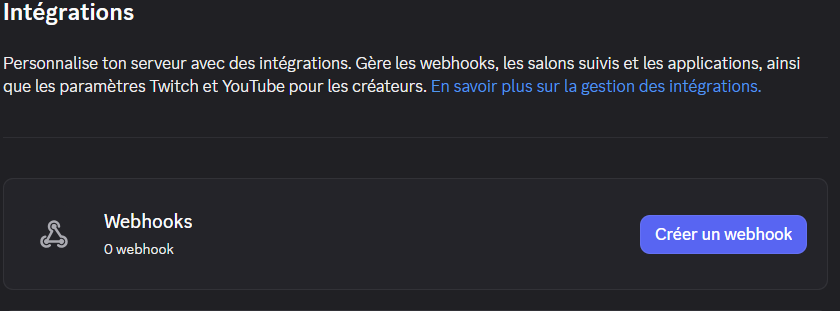
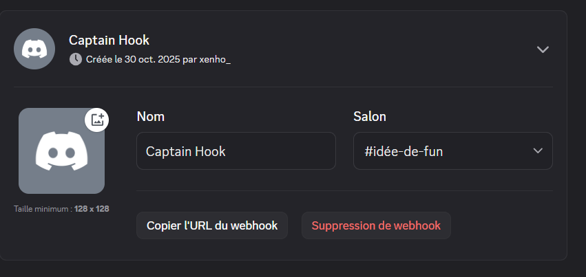

# TP 1 

## 1. Installation et configuration d’un serveur we

### a) simple installation de Apache
### b) Configurer le serveur pour servir une page web simple.

après avoir copié collé le code html à nore disposition, j'obtiens bien une page web sur ma machine virtuelle, comme montré ci-dessous:

 

### c) Vérifier que le serveur est accessible localement via un navigateur.

l'image ci-dessous témoigne le l'accessibilité de ma page web , en effet le lien http://localhost est accessible localement car il pointe vers l’adresse de bouclage (127.0.0.1)

### d)  d. Modifier la configuration pour que le serveur réponde sur un port non standard (ex: 8080)

- On peut observer ci dessous que mon serveur répond désormais sur le port :8080

## 2. Configuration du pare-feu avec  UFW
### a) Configurer un pare-feu pour n’autoriser que les connexions sur le port du serveur web (ex : 8080) et SSH (port 22).

- Installer UFW avec `sudo apt install ufw`

- Autoriser uniquement les ports web et SSH : 

`sudo ufw allow 8080/tcp`
`sudo ufw allow 22/tcp`

- Définir les règles par défaut pour bloquer le reste:

`sudo ufw default deny incoming`
`sudo ufw default allow outgoing`

- Activer le pare-feu

`sudo ufw enable`
Confirmez l’activation si demandé.

- pour vérifier si les règles mises en place fonctionnent:

`sudo ufw status`
on observe bien que les modifications apportées fonctionnent 

et voici le travail effectué dans mon terminal :

## 3. Sécurisation des connexions SSH

- Configurer SSH pour n’accepter que les clés
Générer une clé SSH sur la machine cliente :

`ssh-keygen`
--> Une paire de clés est créée dans le dossier ~/.ssh/.

- Copier ma clé publique vers la machine serveur :

`ssh-copy-id utilisateur@ip_du_serveur`
(évidemment j'ai remplacé par mes informations)

--> ajoute ta clé publique dans le fichier ~/.ssh/authorized_keys sur le serveur.

- Sécuriser la configuration SSH sur le serveur:

Édite le fichier de configuration SSH :

`sudo nano /etc/ssh/sshd_config`

- Redémarrer le service SSH:

`sudo systemctl restart ssh`

# TP 2

## 1) Préparation et configuration du webhook

- Créer un webhook Discord qui va recevoir les alertes de sécurité:

- et voici l'url du webhook que j'ai créé :

url du webhook : https://discord.com/api/webhooks/1433465564013138041/UplSCZjoVoh13brmS20Q-iRQKMUF3tnSJulI3WKALRJ6A4KmaCtQuMLGxmpbvGBwx6Ls

## 2) Surveillance des accès à un fichier sensible
Surveiller en temps réel l’accès à un fichier sensible (/etc/secret.txt) grâce à inotify. En cas d’ouverture, envoyer une alerte Discord.

- creer un fichier surveille-secret.sh

`FILE_TO_WATCH="/etc/secret.txt"
WEBHOOK_URL="https://discord.com/api/webhooks/1433465564013138041/UplSCZjoVoh13brmS20Q-iRQKMUF3tnSJulI3WKALRJ6A4KmaCtQuMLGxmpbvGBwx6Ls"`

`while inotifywait -e open "$FILE_TO_WATCH"; do
  curl -H "Content-Type: application/json" -X POST \
    -d "{\"content\": \"🚨 Accès détecté au fichier secret: $FILE_TO_WATCH\"}" $WEBHOOK_URL
done`

Installer inotify-tools :
`sudo apt-get install inotify-tools`

Rendre le script exécutable :
`chmod +x surveille-secret.sh`

Lancer en continu :
`nohup ./surveille-secret.sh &`

## 3) Surveillance des connexions SSH hors horaires
il fallait :
- Analyser régulièrement les logs SSH (/var/log/auth.log) et envoyer une alerte si une connexion a lieu hors des horaires 09h00–18h00.

script : ssh_alert.sh

`WEBHOOK_URL="https://discord.com/api/webhooks/1433465564013138041/UplSCZjoVoh13brmS20Q-iRQKMUF3tnSJulI3WKALRJ6A4KmaCtQuMLGxmpbvGBwx6Ls"
OFFICE_START=9
OFFICE_END=18
'''Connexions acceptées sur les 5 dernières minutes :'''
logins=$(grep "Accepted" /var/log/auth.log | grep "ssh" | tail -n 20)
while read -r line; do
    hour=$(echo "$line" | awk '{print $3}' | cut -d: -f1)
    if [ "$hour" -lt "$OFFICE_START" ] || [ "$hour" -ge "$OFFICE_END" ]; then
        msg="🔔 Connexion SSH hors horaires bureau (09h–18h): $line"
        curl -H "Content-Type: application/json" -X POST \
          -d "{\"content\":\"$msg\"}" $WEBHOOK_URL
    fi
done <<< "$logins"`

- Afin de rendre le script exécutable :
`chmod +x ssh_alert.sh`

## 4) Automatisation avec cron

- La surveillance de fichier doit tourner en permanence (tâche de fond).

La surveillance SSH doit s’exécuter toutes les 5 minutes via cron, grace a la commande :
`*/5 * * * * /chemin/vers/ssh_alert.sh`

- Modifier la crontab avec crontab -e

- Vérifier le chemin du script dans la crontab (remplace /chemin/vers/ par ton dossier).

- Pour le script de fichier sensible, s’assurer qu’il est bien en arrière-plan (nohup ou terminal dédié).